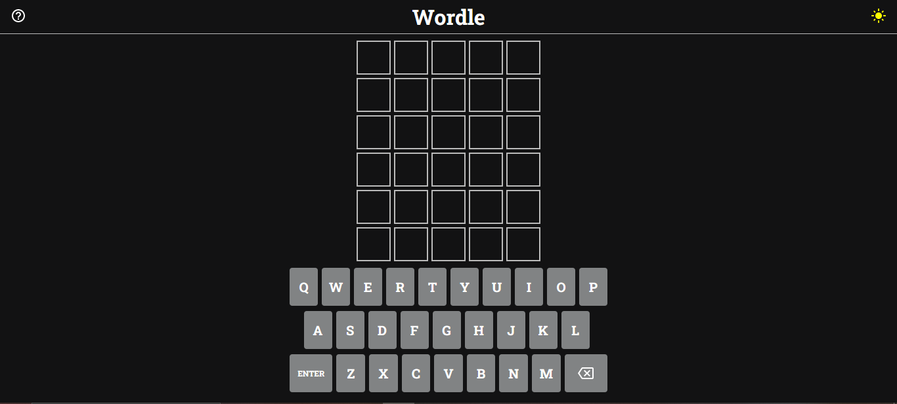
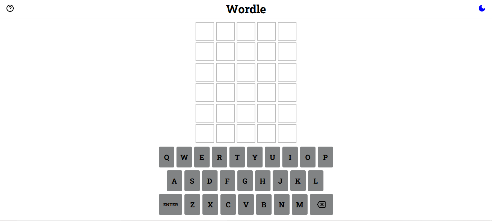
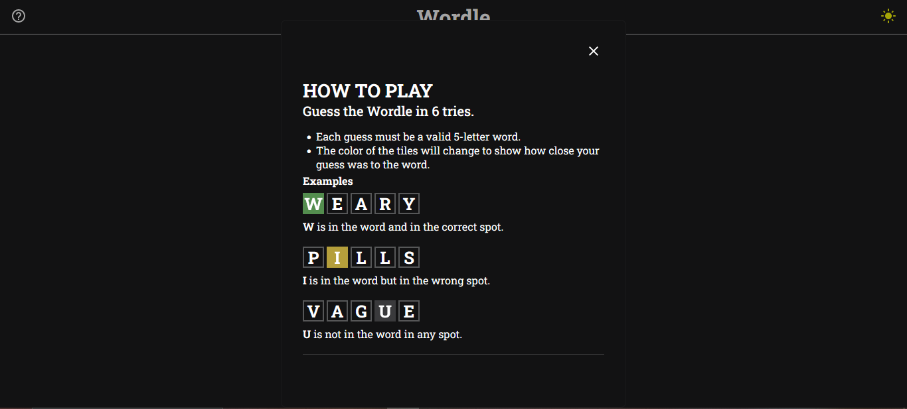
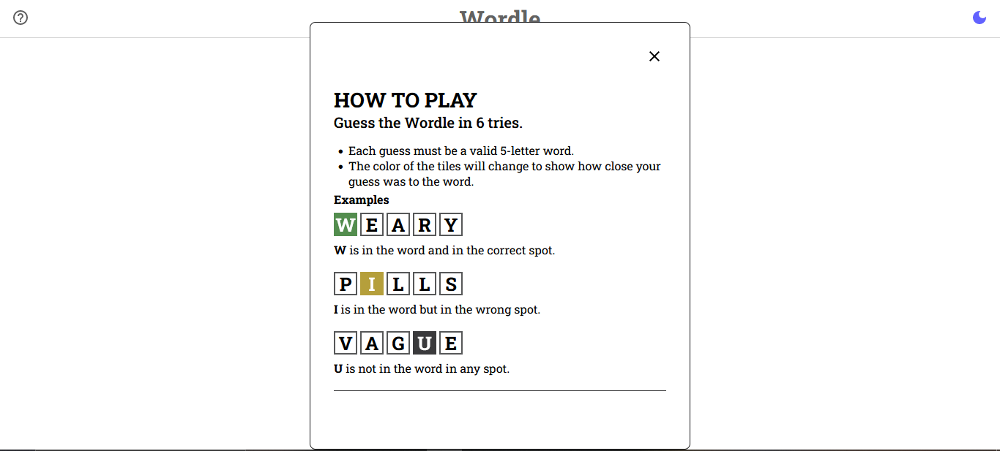

# Project Title

React Wordle Game

## Demo Link:

Access my site at https://59mrrobot.github.io/wordle-project/

## About The App:
  My recreation of the popular game from the New York Times, Wordle.

## Screenshots:

## Technologies:
- TypeScript
- React
- Redux
- Redux Persist
- HTML
- SCSS
- BEM Methodology
- MUI

## Setup:

- Download or clone the repository.
- Install by running `npm install`.
- Start the server by running `npm start`.
- Visit the app at `http://localhost:3000/`.
